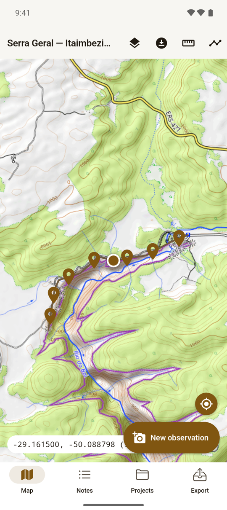
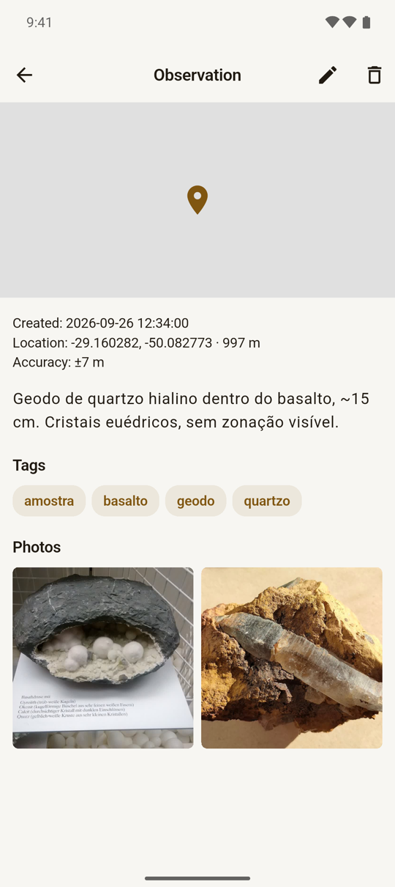
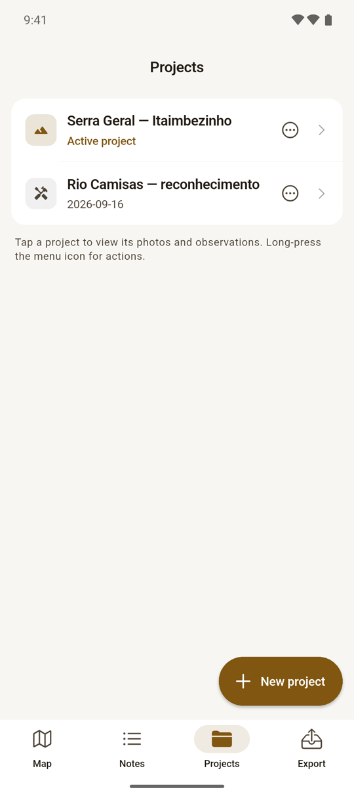
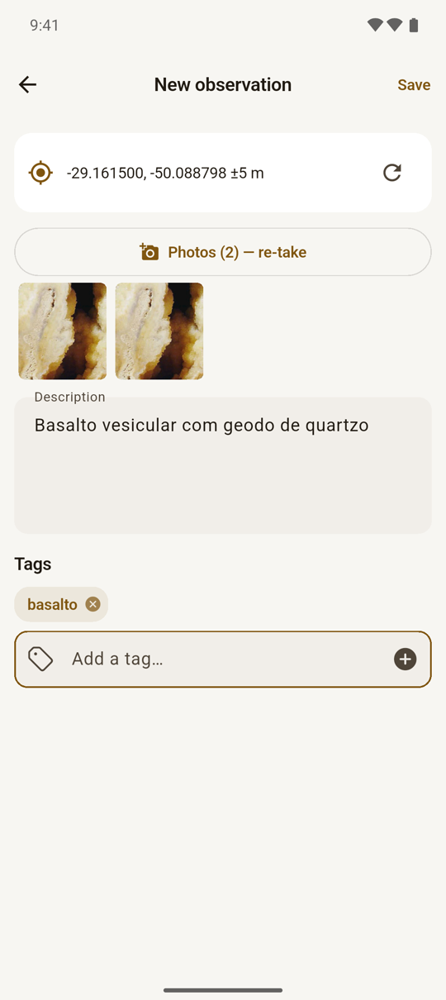
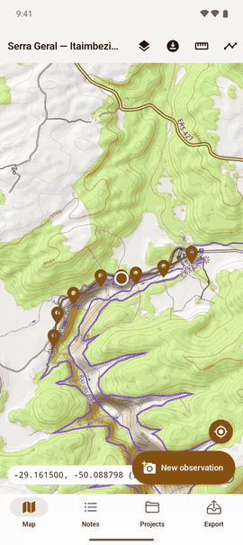

# mappy

um app de campo 100% offline para mapear, fotografar e anotar, sem conta e sem nuvem.

Eu precisava mapear uma região: marcar pontos, tirar fotos amarradas ao GPS, gravar o trajeto e voltar com tudo organizado num projeto. Nenhum app que testei fazia isso sem exigir conta, sync ou assinatura, então fiz o meu. Nasceu para geologia de campo, mas serve para qualquer trabalho de "ponto + foto + descrição + GPS" onde não há sinal.

> Em desenvolvimento ativo e com um único usuário, então coisas quebram. A APK é assinada com a chave de debug e distribuída por instalação direta: nada de Play Store.

  

Site com a demo em vídeo: <https://gstvschlz.github.io/mappy/>

## as telas

| mapa | observação | projetos | nova observação |
| :---: | :---: | :---: | :---: |
|  |  |  |  |
| topo, ruas ou satélite | fotos, descrição, tags e GPS | um por trabalho | o GPS entra ao salvar |

  

## o que tem

- **Mapa** com OpenStreetMap, OpenTopoMap (o padrão, com curvas de nível) e Esri World Imagery, e **pré-download de região** para usar sem internet.
- **Observações**: câmera no app, quantas fotos quiser por parada, descrição e tags com sugestão. O GPS é capturado ao salvar e vai no EXIF (lat, lon, direção e altitude). Pressão longa no mapa cria um ponto à mão.
- **Projetos** com ícone e feed de fotos. Cada um grava o seu **trajeto** num serviço em primeiro plano (dá para gravar dois ao mesmo tempo), com aviso na tela de bloqueio.
- **Régua**: distância entre pontos e, a partir de três, área.
- **Busca**, **lixeira** e **exportação** para um ZIP em `Downloads/mappy/` com `observations.geojson`, `observations.csv`, `tracks.csv` e as fotos.

## como rodar

Ferramentas via [mise](https://mise.jdx.dev): `mise install` traz Flutter, JDK e Android SDK.

- `mise run setup`: dependências e codegen (Drift e Riverpod)
- `mise run analyze` / `mise run test`
- `mise run build`: APK release em `build/app/outputs/flutter-apk/`

Cada push na `main` builda a APK e publica uma [release](https://github.com/gstvschlz/mappy/releases). Para instalar, baixe o `.apk`, permita "fontes desconhecidas" e abra.

## a demo

As imagens e vídeos daqui vêm de um emulador com dados falsos (fotos de domínio público ou CC0, créditos em `tools/demo/fotos/`). Nunca rode o seed num aparelho real: ele apaga o app.

1. `mise run demo-avd` cria o emulador `mappy_demo`; `mise run demo-emulator` liga.
2. `mise run demo-seed` instala a APK e semeia 2 projetos, 10 observações e 2 trajetos.
3. `mise run demo-gravar` grava as telas e clipes; `mise run demo-montar` gera `site/media` e `.github/media`.

## stack

Flutter/Dart com Riverpod, Drift (SQLite), flutter_map + FMTC (cache de tiles), geolocator, camera e native_exif.

## atribuição

Tiles: © OpenStreetMap contributors (ODbL); OpenTopoMap (CC-BY-SA); Esri, Maxar, Earthstar Geographics e a comunidade GIS. Os requests mandam um User-Agent identificável (`mappy/0.1 (geological field mapping; com.scholze.mappy)`): se for forkar, troque o package name antes de bater nos servidores deles, porque OSM e OpenTopoMap limitam quem se passa por outro.
